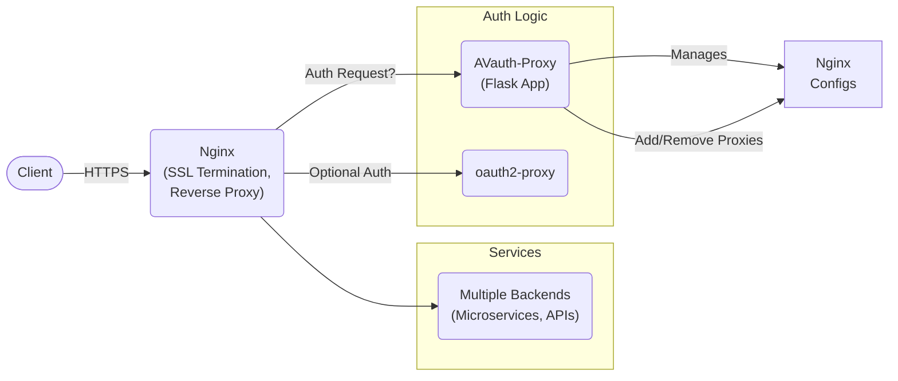

# Avauth-proxy project description

## 1. Introduction

**AVauth-Proxy** is a dynamic reverse-proxy management system integrating OAuth2 authentication. It allows administrators to define and configure N backend services, each optionally protected behind an OAuth-based login. The system features an **admin dashboard** to create, modify, or remove proxy definitions on-the-fly. Nginx serves as the primary gateway, while a Flask application manages routing configurations, optional whitelisting, and user sessions.

### 1.1. Purpose of This Document

This document specifies the **goals, requirements, and design** of the AVauth-Proxy solution. It can serve as a **Software Requirements Specification (SRS)** or **Functional Specification**, detailing functionality for a development team or stakeholders. It clarifies how the system works and what it aims to accomplish, ensuring consistent understanding across all parties involved.

------

## 2. Project Overview

1. **Core Goal**: Provide a **unified, dynamically configured gateway** for multiple backend services (microservices, APIs, apps), with optional OAuth authentication and fine-grained access control.
2. **Key Functions**:
    - **Proxy Management**: Administrators can add or remove proxies (backends) via a dashboard.
    - **Authentication**:
        - **Internal**: The system can handle OAuth flows using Authlib (Google, Microsoft, etc.).
        - **External**: The system can delegate authentication to an external `oauth2-proxy` service.
    - **Access Control**:
        - Services may be publicly accessible or restricted to logged-in users.
        - Whitelists allow restricting access to specific emails or domains.
    - **Admin-Only Dashboard**: Only authorized “admin” emails can modify or remove proxy entries.
    - **Metrics**: Exposes a Prometheus endpoint (`/metrics`) for monitoring.
3. **Primary Technologies**:
    - **Nginx**: Acts as SSL termination and a reverse proxy, dynamically reloaded with new configurations.
    - **Flask (Python)**: Hosts the admin UI and handles authentication logic (or delegates to `oauth2-proxy`).
    - **Gunicorn**: Production-ready WSGI server for the Flask app.
    - **Docker**: Containerization for easy deployment.

------

## 3. High-Level Architecture



### 3.1. Data Flow

1. **Client** sends a request to `Nginx` at `https://mydomain/...`.

2. Nginx

     checks if the requested service requires auth:

    - If yes, it calls `auth_request` on the Flask app or external `oauth2-proxy`.
    - If user is unauthorized, Nginx returns an error or redirects to a login flow.

3. Flask

     (if using internal OAuth):

    - Redirects the user to the provider (e.g., Google) for sign-in.
    - On success, stores user info in the session.
    - Returns `200` to Nginx if user passes a whitelist check.

4. **Nginx** proxies the request to the configured backend (microservice).

### 3.2. Dynamic Configuration

- Admins add or remove “proxies” from the dashboard.
- Each “proxy” is a specification of:
    - **Service name**: A label or subdomain.
    - **URL/IP** + **Port**: The upstream destination.
    - **Auth required**: Boolean.
    - **Email/domain whitelists** (optional).
- The app writes an Nginx config file for each proxy and triggers a reload. No container restart needed.

------

## 4. Detailed Features

### 4.1. Admin Dashboard

- **Route**: `/proxy/dashboard`
- **Authentication**: Must be an “admin email” to use.
- Functions:
    1. **List Existing Proxies**: Shows service name, upstream URL, port, template, auth status, etc.
    2. **Add a New Proxy**: Form fields for service name, host/port, template type, auth toggle, allowed emails/domains, etc.
    3. **Remove a Proxy**: Single-click to delete. The system updates TOML or other config data, regenerates the Nginx config, and reloads.

### 4.2. Authentication Options

1. Internal:
    - Uses **Authlib**. The user chooses a provider (Google, Microsoft, etc.).
    - The user’s email is stored in `session["user"].email`.
    - Nginx calls `/auth/validate/<service_name>` to see if the user is authorized to access that service.
2. External:
    - The system runs `oauth2-proxy` in a container.
    - Nginx `auth_request` points to `/oauth2/auth`, `error_page 401 = /oauth2/sign_in`.
    - The Flask app does not handle the login flows directly.

### 4.3. Per-Service Whitelisting

- Each service can define:
    - `auth_required: true/false`
    - `allowed_emails: ["alice@domain.com", ...]`
    - `allowed_domains: ["mycompany.com", ...]`
- The **validate** route checks if the user is logged in and if their email (or domain) matches. Returns `200` if OK, `401/403` otherwise.

### 4.4. Metrics

- The system exports Prometheus metrics at 

    ```
    /metrics
    ```

    . This includes:

    - Number of proxies defined
    - Authentication failures
    - Other custom metrics for usage

### 4.5. Logging

- **Flask/Gunicorn** logs appear in container stdout (accessible via `docker logs`).
- **Nginx** logs in default access/error logs.
- Optional “events.log” for capturing admin activities like “Added new proxy,” “Removed proxy,” etc.

------

## 5. Technical Requirements

1. Infrastructure:
    - Docker & Docker Compose (version 3.8+).
    - Python 3.11 or above for the Flask app (if running natively).
2. Certificates:
    - Valid TLS certificate for domain(s) served by Nginx.
    - Or use self-signed certificates for testing.
3. Environment Variables:
    - `SECRET_KEY` for Flask sessions (if not set in `config.toml`).
    - `CONFIG_TOML_FILE` can override the default path for config.
4. Ports:
    - Nginx: 80 (HTTP), 443 (HTTPS).
    - App (Gunicorn): 5000 (internal).
    - Optionally `oauth2_proxy`: 4180.

------

## 6. Implementation Details

1. Directory Layout:

    - `avauth_proxy/`: Flask modules (blueprints, utils, config).
    - `nginx_templates/`: Jinja2 files for generating Nginx config.
    - `tests/`: Pytest-based unit and integration tests.
    - `docker-compose.yaml`: Declares the main app, Nginx, and optionally oauth2-proxy containers.

2. Nginx Config Generation

     (

    ```
    nginx_utils.py
    ```

    ):

    - Reads `proxies_config.toml` or database entries for all proxies.
    - For each proxy, selects the appropriate template (`default.conf.j2`, `oauth2_disabled.conf.j2`, etc.).
    - Renders the template with the service’s data (URL, port, auth_required, etc.).
    - Writes `.conf` file to `/etc/nginx/conf.d/proxies/`.
    - Issues `nginx -s reload`.

3. Flask App:

    - **`__init__.py`**: Creates the `Flask` instance, loads config, sets up OAuth if internal mode, registers blueprints.
    - **`auth_routes.py`**: Contains `/auth/login`, `/auth/authorize`, `/auth/validate/<service_name>`.
    - **`proxy_routes.py`**: The admin dashboard at `/proxy/dashboard`, plus add/remove proxies.
    - **`metrics_routes.py`**: Exposes Prometheus metrics at `/metrics`.

4. Auth Flow:

    - If internal: `auth/login -> Google/Microsoft -> back to /auth/authorize/<provider>` -> store user in session.
    - If external: Nginx’s `auth_request` hits `oauth2-proxy`. The Flask app is bypassed for authentication checks.

------

## 7. Use Cases

1. Single-Org Multi-Service Gateway:
    - The admin sets up 10 internal services behind `mycompany.internal`.
    - Some require domain-based access (only `@mycompany.com`), others are public.
    - Internal OAuth is used with a Google Workspace domain check.
2. Public-Facing App:
    - Two services: “public site” (no auth) and “admin panel” (restricted to a few whitelisted emails).
    - The admin panel’s address is also behind a subdomain if desired (`admin.example.com`).
3. Hybrid:
    - Services that trust external `oauth2-proxy` for SSO. The code sets `use_oauth2_proxy = true`, hooking into corporate SSO easily.

------

## 8. Future Enhancements

- **User Database**: Optionally store user records, roles, or advanced ACL.
- **Role-Based Access**: Instead of whitelists, define roles like “admin,” “dev,” “tester,” each with distinct access.
- **Automated SSL**: Integration with Let’s Encrypt or a certificate manager for subdomains.
- **Advanced Observability**: Additional metrics, distributed tracing for requests across proxies.

------

## 9. Summary

**AVauth-Proxy** provides a **central, extensible** solution for organizations needing to:

- Dynamically manage multiple proxy endpoints.
- Integrate OAuth-based authentication (internal or external).
- Enforce fine-grained restrictions (allowed emails, domains).
- Give a secure, admin-only UI to modify or remove backends in real time.

